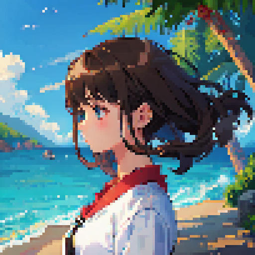
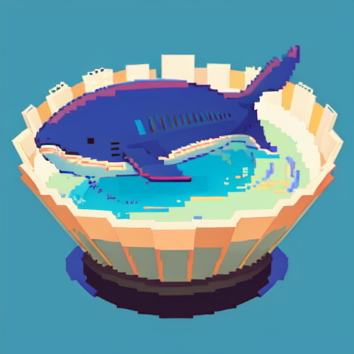
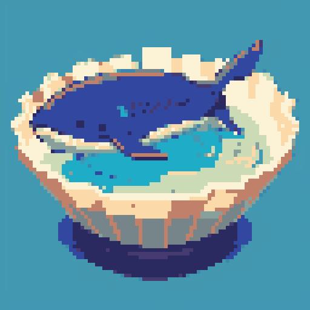
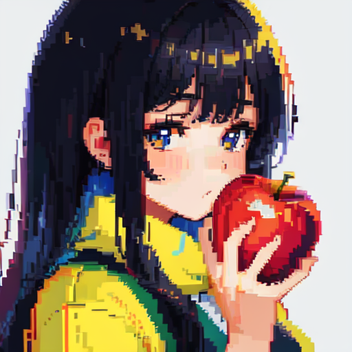
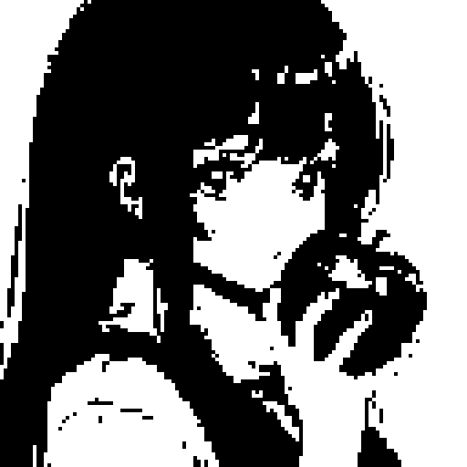

# Pixel
Adds various useful tools for pixel art to the Extras tab.

### Purpose
This extension is used to fix non symmetrical pixels in ai pixel art through downscaling.
It also can be used to limit color palette and clamp grayscale values to get more stylized results. You can also use the rescale feature to get a higher resolution image (best for preview on the webui canvas).

For use with this [webui](https://github.com/AUTOMATIC1111/stable-diffusion-webui)

# Installation Guide
Install from webui's Extensions tab.

Extensions > Install from URL > Paste `https://github.com/Leodotpy/sd-pixel` > Install

# Feature Comparison Examples

| Effect  | Before | After |
|---------|--------|-------|
| Downscale |  |  |
| Color Palette Limit |  |  |
| Gray Limit |  |  |

# Credits
* Thanks AUTOMATIC1111 for an awesome sd webui
